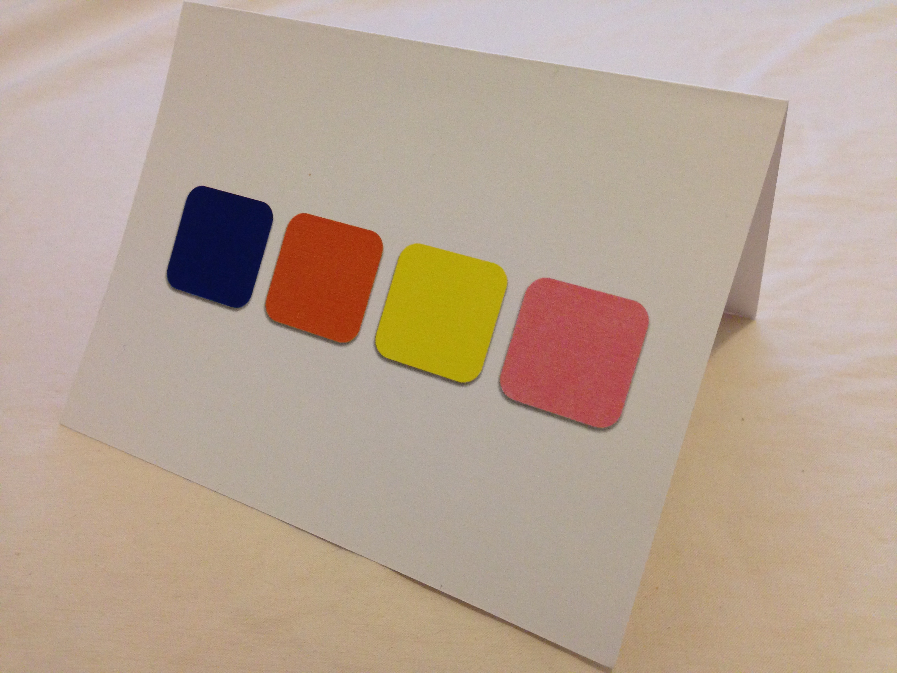
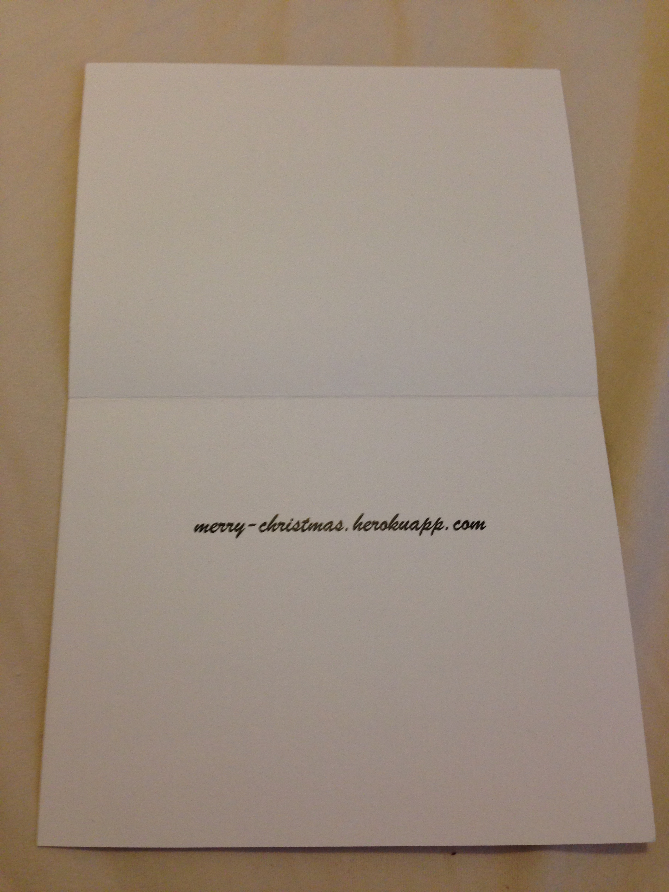

# merry-christmas -  A christmas card for 2013

This is a personal project of mine to create a webapp companion for the Christmas cards
I am sending out in 2013. Recipeients will be mailed a christmas card with a unique 4
color combination on the front. Inside of each card will be a link to this webapp hosted
on a remote heroku repository - "merry-christmas.herokuapp.com". On that website,
recipients may enter their unique 4 color combination and a custom christmas card will
be pulled up for them on the webpage. This is my first AngularJS webapp.

## Security

In designing this webapp, there were some considerations I made in regards to security.
There are in total 8 different colors and 4 squares. This gives only 4096 distinct color
combinations and therefore it would be very easy for someone to figure out all the valid
color combinations by brute force. The reason I chose to only have 8 different colors
and 4 squares was purely a stylistic choice. I thought that any more colors may make it
difficult to distinguish between certain colors and any more squares would subtract from
the simplistic style of the card. I figured since I was only sending out cards to my
close friends, this level of security would be sufficient.

## Example Card

## Resources

* angular-seed https://github.com/angular/angular-seed
* snow effect http://thecodeplayer.com/walkthrough/html5-canvas-snow-effect
* Crypto-JS https://code.google.com/p/crypto-js/